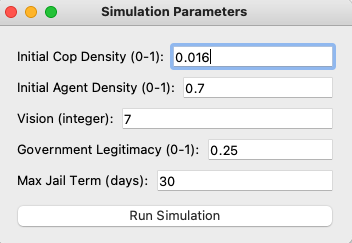
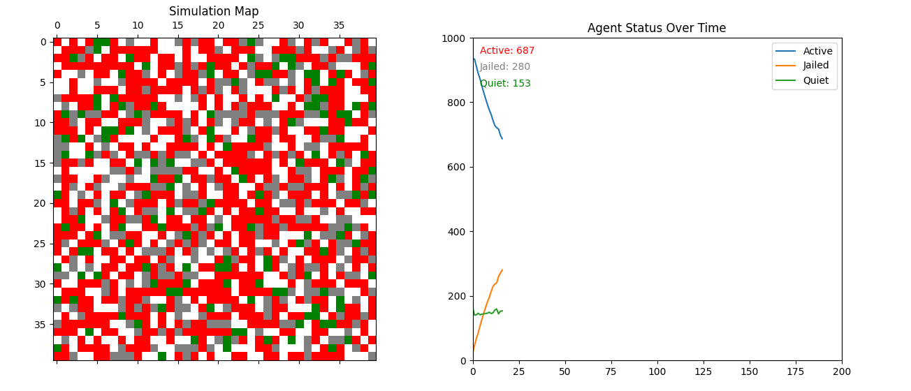

# Rebellion_system_model

This python software create a complex software system about rebellion. You can type several parameter to change the behavior of the system and analysis them. Also there will be a line chart to help you analyse the enviornment.

# How to use.

step 1:
Install all the package needed for this project. 1. numpy 2. matplotlib 3. PyQt5
step 2:
Run the main.py, and then you will see this following interface.

step 3:
Click run simulation, you will see the world be simulated, with one line char near it:

step 4:
close the simulation interface, you can re-enter setting parameter and run again.

# Settings

In the output simulation map, different color squares represent different characters:
white: empty space
black: cops
green: quite agent
red: active agent
grey: agent in jail
